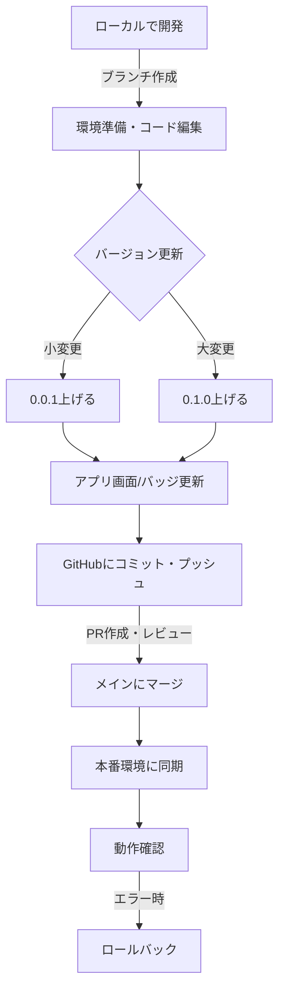

Google認証設定と設定ファイル管理に関するガイドラインを# 開発手順ガイドライン

## 概要

このドキュメントは、すべてのプロジェクトで共通の開発手順を定義します。プロジェクト固有の手順（例：テスト方法、環境設定）は、各リポジトリの`README.md`または`DEVELOPMENT.md`を参照してください。本ガイドラインは、開発効率の向上と一貫したワークフローの確立を目的としています。

## 推奨フォルダ構成とGitHub連携

- プロジェクト直下に `github` フォルダを作成し、バージョン管理対象の開発用プログラムやスクリプトはこの中に配置すること。
- 例：
  - `github/ekiten_scraper.py` … スクレイピング等の開発用コード
  - `github/`配下に将来的にREADMEやrequirements.txt等も配置可
- GitHubリポジトリ初期化・連携は `github` フォルダをルートとして行うことを推奨。

## 前提条件

- **開発環境**：ローカルマシンにGit、テキストエディタ（VS Code推奨）、およびプロジェクト固有のランタイム（例：Node.js、PHP）がインストール済み。
- **GitHubアカウント**：リポジトリへの書き込み権限を保有。
- **CI/CD設定**：プロジェクトに応じてGitHub ActionsなどのCI/CDパイプラインが設定済み（任意）。

## 開発手順

### 1. ローカルで開発

- 環境準備

  ：

  - リポジトリをクローン：`git clone <repository-url>`
  - 依存関係をインストール（例：`npm install`や`composer install`）。
  - プロジェクト固有の設定ファイル（例：`.env`）をコピーして設定。

- 開発作業

  ：

  - ブランチを作成：`git checkout -b feature/<feature-name>`（例：`feature/add-pdf-export`）。
  - コードをローカルで編集。
  - 必要に応じてローカルでテスト（プロジェクト仕様による）。

- コード品質

  ：

  - リンター/フォーマッターを使用（例：ESLint、Prettier）。
  - コミット前にコードレビュー用の差分を確認：`git diff`。

### 2. バージョニング

- バージョン更新ルール

  ：

  - 小さな変更（バグ修正、軽微な機能追加）：最後の桁を上げる（例：`0.0.1` → `0.0.2`）。
  - 大きな変更（新機能、構造変更）：中間の桁を上げる（例：`0.0.1` → `0.1.0`）。
  - 破壊的変更（互換性のない変更）：最初の桁を上げる（例：`0.1.0` → `1.0.0`）。

- 更新方法

  ：

  - `package.json`、ドキュメント（例：`README.md`）、またはコード内のバージョン定数を更新。
  - 例（Node.js）：`npm version patch`（小変更の場合）。

- チェックリスト

  ：

  - バージョンの上げ忘れがないか確認。
  - 変更ログ（`CHANGELOG.md`）に更新内容を記載（例：`## [0.0.2] - 2025-05-30`）。

### 3. アプリケーション画面とGitHubバッジの更新

- アプリケーション画面

  ：

  - バージョン表示を更新（例：フッターに「Version 0.0.2」）。
  - 必要に応じてUIの変更をスクリーンショットで記録。

- GitHubバッジ

  ：

  - `README.md`のバッジを更新（例：ビルドステータス、バージョン、カバレッジ）。

  - 例（Markdown）：

    ```markdown
    
    
    ```

  - バッジ生成ツール（例：Shields.io）を活用。

- 自動化

  ：

  - CI/CDパイプラインでバッジを自動更新する設定を推奨。

### 4. GitHubリポジトリの更新

- コミット

  ：

  - 変更をステージング：`git add .`
  - コミットメッセージはConventional Commits規約に従う：
    - 機能追加：`feat: add new feature`
    - バグ修正：`fix: resolve login error`
    - リファクタリング：`refactor: improve code structure`
  - 例：`git commit -m "feat: implement PDF export functionality"`

- プッシュ

  ：

  - ブランチをプッシュ：`git push origin feature/<feature-name>`
  - プルリクエスト（PR）を作成し、必要に応じてレビューを依頼。

- マージ

  ：

  - PRが承認されたら、メインブランチ（例：`main`）にマージ。
  - マージ後、ブランチを削除（例：`git push origin --delete feature/<feature-name>`）。

- エラーハンドリング

  ：

  - プッシュ失敗時：`git fetch`で最新状態を確認し、コンフリクトを解決。
  - CI/CDエラー時：ログを確認し、修正を再コミット。

### 5. 本番環境への同期

- 同期方法

  ：

  - 本番環境はGitHubリポジトリと同期（例：`git pull origin main`）。
  - デプロイツール（例：Vercel、Netlify、またはカスタムスクリプト）を使用。

- 動作確認

  ：

  - デプロイ後、本番環境で機能テストを実施。
  - 例：WebPoliceの場合、URL（https://apl.chotto.news/tools/webpolice/）にアクセスし、PDF出力や技術分析を確認。

- ロールバック

  ：

  - 問題発生時、前のコミットにロールバック（例：`git revert <commit-hash>`）。
  - 本番環境のバックアップを事前に確認。

## 開発進捗の記録

- 開発が始まったら、進捗状況を`開発進捗.md`に記録してください。これにはタスクの進行状況、課題、変更履歴などが含まれます。
- 各項目には、日付だけでなく時間も含めた詳細なタイムスタンプを記録してください（例：`2025-06-30 20:15`）。
- 特に重要な作業や課題の発見、解決時には、正確な時間記録がトラブルシューティングや進捗把握に役立ちます。
- 時間帯が明確でない場合は、国際的な混乱を避けるためにタイムゾーン（例：JST）も記載することをお勧めします。
- 定期的に更新し、プロジェクトの透明性と効率を向上させます。

## 注意事項

- **ローカルテスト**：プロジェクトによってはローカルテストが不要（例：WebPoliceは本番でテスト）。
- **パーミッション**：本番環境のディレクトリ（例：`tmp/`）に適切なパーミッションを設定（例：`chmod 777 tmp/`）。
- **設定ファイル管理**：
  - APIキーや認証情報などの機密情報はHTMLやJSファイルに直接記述せず、専用の設定ファイル（例：`config.js`）に分離する。
  - 設定ファイルはバージョン管理から除外するため、`.gitignore`に追加する。
  - 開発者向けにはサンプル設定ファイル（例：`config.sample.js`）を用意し、ドキュメントに設定手順を記述する。

### 設定ファイルの管理

- クライアントIDやAPIキーなどの機密情報はソースコードに直接埋め込まず、`config.js`に分離します。
- `config.js`はバージョン管理から除外し、リポジトリにプッシュしないようにします。
- 各開発者はリポジトリから`config.sample.js`をコピーして独自の`config.js`を作成し、必要な設定を行います。

- **OAuth認証設定**：
  - Google OAuthなどの認証では、承認済み生成元（Authorized JavaScript Origins）にアプリのURLを必ず登録する。
  - ローカル開発環境用と本番環境用の生成元を適切に設定する。
- **セキュリティ**：機密情報（APIキー、環境変数）は`.env`ファイルや秘密管理ツールで管理。
- **ドキュメント更新**：コード変更に伴い、関連ドキュメントを常に最新に保つ。
- **バックアップ**：本番環境のデータや設定を定期的にバックアップ。

## 推奨ツール

- **エディタ**：VS Code（拡張機能：GitLens、Prettier）
- **バージョン管理**：Git、GitHub Desktop（初心者向け）
- **CI/CD**：GitHub Actions、CircleCI
- **ドキュメント**：Markdown、Mermaid（フローチャート用）

## フローチャート

以下の図は、開発フローを視覚化したものです（Mermaid記法）。



## 関連資料

- **コミット規約**：[Conventional Commits](https://www.conventionalcommits.org/)
- **バッジ生成**：[Shields.io](https://shields.io/)
- **GitHub Actions**：[公式ドキュメント](https://docs.github.com/en/actions)
- **プロジェクト固有手順**：各リポジトリの`README.md`または`DEVELOPMENT.md`

## コーディング規約

### ファイルの行数とリファクタリング

コードの可読性と保守性を高く保つため、1つのファイルが長くなりすぎないように注意します。

- **250行の目安**: 1つのプログラムファイル（特にReactコンポーネントなど）の長さが**250行**を超えた場合、それはファイルが多くの責務を持ちすぎているサインです。
- **リファクタリングのタイミング**: 機能が安定し、動作が確認できた時点で、積極的にリファクタリングを行ってください。
- **分割の考え方**:
    - **カスタムフック**: 複数のコンポーネントで再利用可能なロジックは、カスタムフック（例: `useBusinessData.ts`）として切り出します。
    - **コンポーネント分割**: 巨大なコンポーネントは、より小さな、自己完結した子コンポーネントに分割します。（例: `DataSourceSelector.tsx`）
    - **サービス層**: API通信や複雑なビジネスロジックは、サービスファイル（例: `supabaseBusinessService.ts`）に分離します。

このルールを設けることで、将来の機能追加やデバッグが容易になり、チーム全体の開発効率が向上します。


## 更新履歴

- 2025-05-30：初版作成
- 2025-06-04：追加